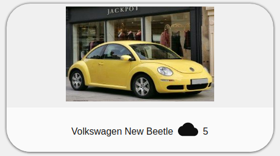
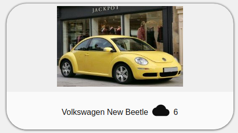

## 4 Segundo ejemplo

En este ejemplo se muestra la creación de un portal de imágenes utilizando diversos componentes disponibles en [polymer-proyect.org]. Para ello se ha modificado el comportamiento de nuestro componente prueba-2-app.js para que sea capaz de mostrar una foto de manera elegante y estructurada junto a un pequeño icono el cual actúa como contador de, por ejemplo, me gustas. A continuación se explicarán las principales directrices seguidas para realizar este ejemplo.

### 4.1 Componente

En este caso, el componente se encarga de mostrar imágenes como se ha dicho previamente. Para ello se le han declarado una serie de propiedades estáticas necesarias para que este sea capaz de mostrar la imagen de forma idónea. Estas propiedades son:

* **nombre**: variable de tipo *String*. Será el nombre se mostrará como pie de foto.

* **forma**: variable de tipo *String*. Indicará al elemento el nombre del icono a mostrar. Podeis encontrar el nombre de algunos iconos en el siguiente [enlace].

[enlace]:https://www.webcomponents.org/element/@polymer/iron-icons/demo/demo/index.html

* **ruta**: variable de tipo *String*. Establecerá la ruta en la que se buscará la imagen a mostrar. Si la ruta es errónea o no existe la imagen, no se mostrará nada.

* **contador**: variable de tipo *Number*. Servirá para proponer el valor inicial del contador de me gustas, como hemos indicado. En caso contrario tendrá el valor 0.

Pero... ¿cómo le mandamos estos parámetros a mi componente?. Para ello estableceremos las propiedades en nuestra etiqueta en el fichero .html de la siguiente forma:
```
<prueba-2-app nombre="Ferrari" forma="star" ruta="../ruta/imagen"></prueba-2-app>
```

Una vez tenemos las propiedades que queremos, el componente tiene definido un estilo en CSS para mostrar la imagen de manera elegante y estructurada. Es un estilo sencillo e intuitivo para que sea lo más inteligible posible y centrarnos en la complejidad del componente en si. Cualquier duda sobre el código CSS se podrá encontrar facilmente en [W3C].

[W3C]:https://www.w3schools.com/css/

Por último, este componente tiene definida una funcion anónima la cual se encarga de aumentar el valor de la propiedad **contador** definida anteriormente. Esta función es utilizada como respuesta al evento *onclick* del botón con la forma del icono que nosotros hemos establecido previamente. Esta función es tan simple como:
```
  function(tipo) {
    this.contador++;
  }
```
Para ver mejor su funcionalidad, se dispone a continuación de un ejemplo:
* Antes de clicar en el icono:



* Después de clicar en el icono:



### 4.2 Funcionalidad adicional

En este apartado se explicarán algunas funcionalidades interesantes que se han añadido al ejemplo actual. Unicamente con la finalidad de mostrar como podemos combinar el uso de nuestros componentes creados con polymer con otros componentes ya creados o, incluso, funcionalidad que nosotros hemos creado con JavaScript:

* Modo noche o modo nocturno.

* Añadir un coche en vivo.
