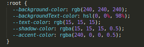
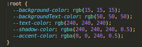
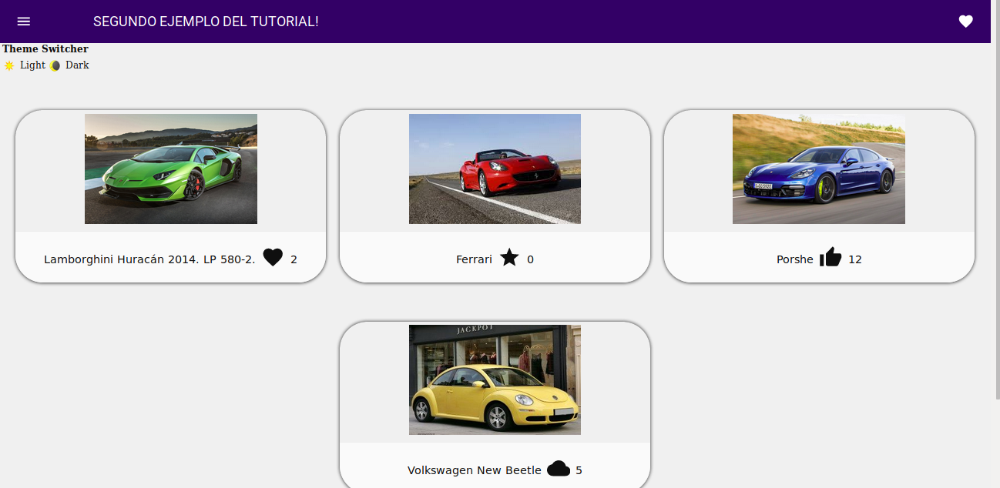
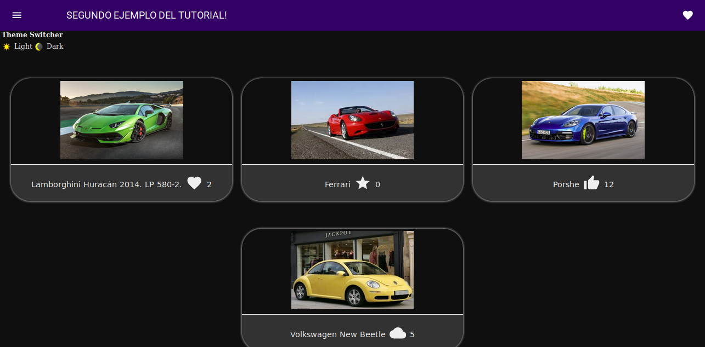
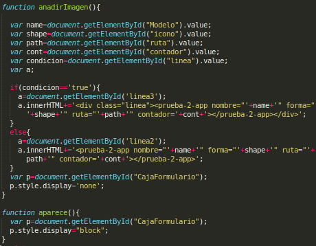

En este ejemplo se muestra la creación de un portal de imágenes utilizando diversos componentes disponibles en [polymer-proyect.org]. Para ello se ha modificado el comportamiento de nuestro componente prueba-2-app.js para que sea capaz de mostrar una foto de manera elegante y estructurada junto a un pequeño icono el cual actúa como contador de, por ejemplo, me gustas. A continuación se explicarán las principales directrices seguidas para realizar este ejemplo.

[polymer-proyect.org]:https://www.polymer-project.org/

## 1. Componente

En este caso, el componente se encarga de mostrar imágenes como se ha dicho previamente. Para ello se le han declarado una serie de propiedades necesarias para que este sea capaz de mostrar la imagen de forma idónea. Estas propiedades son:

* **nombre**: variable de tipo *String*. Será el nombre se mostrará como pie de foto.

* **forma**: variable de tipo *String*. Indicará al elemento el nombre del icono a mostrar. Podeis encontrar el nombre de algunos iconos en el siguiente [enlace].

[enlace]:https://www.webcomponents.org/element/@polymer/iron-icons/demo/demo/index.html

* **ruta**: variable de tipo *String*. Establecerá la ruta en la que se buscará la imagen a mostrar. Si la ruta es errónea o no existe la imagen, no se mostrará nada.

* **contador**: variable de tipo *Number*. Servirá para proponer el valor inicial del contador de me gustas, como hemos indicado. Por defecto tendrá el valor 0.

Pero... ¿cómo le mandamos estos parámetros a mi componente?. Para ello estableceremos las propiedades en nuestra etiqueta en el fichero html de la siguiente forma:
```
<prueba-2-app nombre="Ferrari" forma="star" ruta="../ruta/imagen" contador="5"></prueba-2-app>
```

Una vez tenemos las propiedades que queremos, el componente tiene definido un estilo en CSS para mostrar la imagen de manera elegante y estructurada. Es un estilo sencillo e intuitivo para que sea lo más inteligible posible y centrarnos en la complejidad del componente en si. Cualquier duda sobre el código CSS se podrá consultar fácilmente en [W3C].

[W3C]:https://www.w3schools.com/css/

Por último, este componente tiene definida una función anónima la cual se encarga de aumentar el valor de la propiedad **contador** definida anteriormente. Esta función es utilizada como respuesta al evento *onclick* del botón con la forma del icono que nosotros hemos establecido previamente. Esta función es tan simple como:
```
  function() {
    this.contador++;
  }
```
Para ver mejor su funcionalidad, se dispone a continuación de un ejemplo:
* Antes de clicar en el icono:


* Después de clicar en el icono:


## 2. Funcionalidad adicional

En este apartado se explicarán algunas funcionalidades interesantes que se han añadido al ejemplo actual. Únicamente con la finalidad de mostrar cómo podemos combinar el uso de nuestros componentes creados con Polymer con otros componentes ya creados y, por supuesto, con funcionalidades que nosotros hemos creado con JavaScript:

* Modo noche o modo nocturno.

* Añadir un coche en vivo.

### 2.1 Modo nocturno

A continuación, veamos lo fácil que es reutilizar un componente ya creado por otro usuario. En nuestro caso, hemos elegido un componente llamado **dark-mode-toggle**, creado por GoogleChromeLabs, el cual nos permite con un simple botón poder cambiar el estilo de nuestra página web para intercambiar entre el modo normal y el modo nocturno (con colores más oscuros). Aquí el enlace del componente: https://www.webcomponents.org/element/dark-mode-toggle.

En el enlace se muestran todas las propiedades y posibilidades que tiene el componente, mientras que aquí nos centraremos principalmente en cómo lo hemos podido implementar con nuestro componente.

En primer lugar, debemos añadir en nuestro package.js una línea con la dependencia del componente:
```
"dark-mode-toggle": "^0.4.12"
```
Una vez hecho esto, será necesario instalar las dependencias con el comando:
```
npm install --save dark-mode-toggle
```
A continuación tenemos que importarlo a nuestro componente añadiendo la línea en el prueba-2.js:
```
import * as DarkModeToggle from './node_modules/dark-mode-toggle';
```
Por último, para que nuestro index conozca los distintos estilos dependiendo de si está seleccionado el modo nocturno o el diurno, y pueda ejecutar la funcionalidad del dark-mode-toogle, debemos añadir:
```
<link rel="stylesheet" href="common.css">
<link rel="stylesheet" href="light.css" media="(prefers-color-scheme: light), (prefers-color-scheme: no-preference)">
<link rel="stylesheet" href="dark.css" media="(prefers-color-scheme: dark)">
    
<script type="module" src=./node_modules/dark-mode-toggle/src/dark-mode-toggle.mjs/></script>
```
Con esto, usando las hojas de estilo que se aportan con el componente ya podríamos cambiar una página web básica a un modo nocturno. Para personalizar los estilos, se tendría que modificar el valor de las variables que emplearemos en el common.css dentro de light.css y dark.css. Nosotros en nuestro caso, tuvimos que crear una nueva variable (*backgroundText-color*) para ajustar el color de nuestro marco de imágenes según el estilo que le queríamos dar en los distintos modos:

* light.css:



* dark.css:



A continuación, veamos el resultado:
* Modo diurno:



* Modo nocturno:



### 2.2 Funcionalidad JavaScript

Para crear un nuevo componente de manera dinámica, mediante JavaScript hemos modificado el árbol DOM para mostrar un formulario, de manera que al rellenarlo se le envíen los datos a nuestro componente de Polymer y se muestre en la ventana. El código empleado es el siguiente:



Básicamente, hemos creado dos funciones para lograr esto:
* *anadirImagen()*: se encarga de asignar los valores del formulario a las variables que se le pasan a nuestro componente para mostrar la imagen.
* *aparece()*: se encarga de mostrar el formulario para introducir los datos de la imagen.
