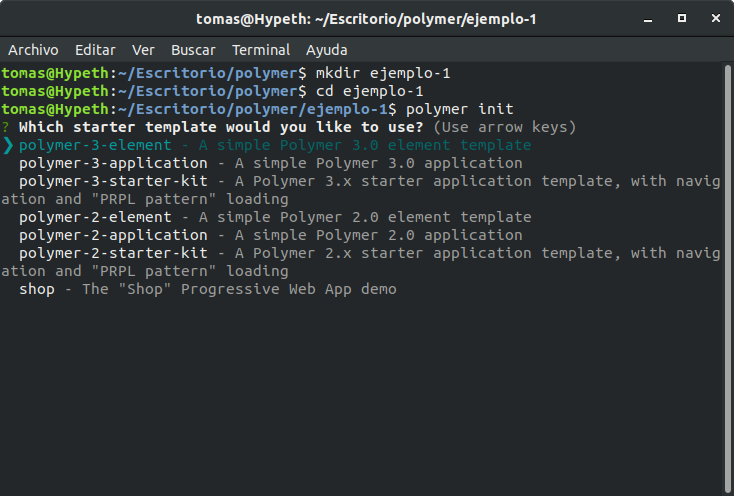
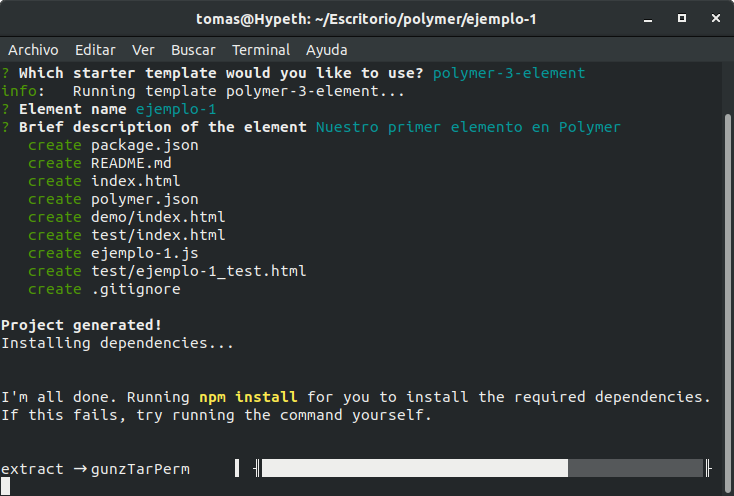
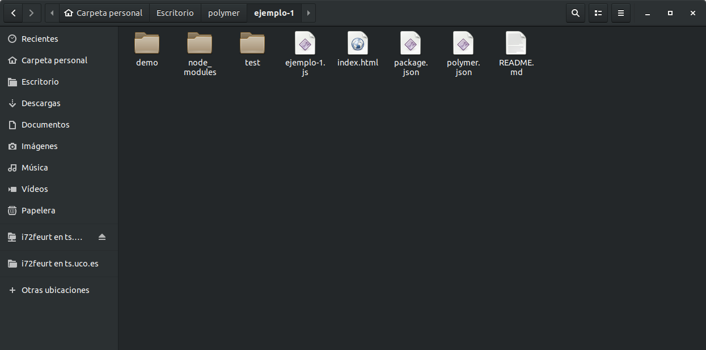
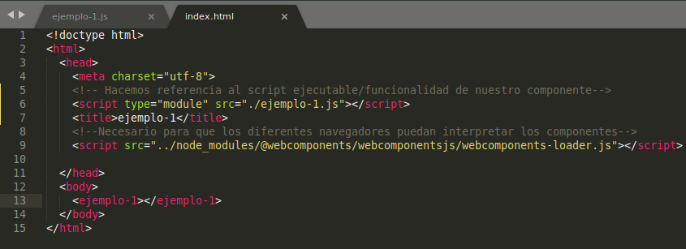

## 3 Primeros pasos

Una vez instalado polymer, creamos un directorio en el cual se almacenarán los ficheros que nos proporcionará polymer, en nuestro caso “ejemplo-1”. Una vez en él, realizamos el comando polymer init, en el directorio en el que deseemos trabajar, para iniciar nuestro proyecto. Tras esto:



Cabe diferenciar, de la salida de este comando, las diferentes opciones que polymer nos proporciona:
* **polymer-3-element**: crea un fichero javascript (ejemplo-1.js) que conforma una plantilla básica para nuestro elemento. Además, proporciona un fichero html para la demostración  de su uso.

* **polymer-3-application**: crea un fichero html que conforma una plantilla básica de utilización de un elemento. Al igual que polymer-3-element, crea un fichero javascript que es la plantilla del elemento utilizada pero, en este caso, está situado en directorio src al cual se hace referencia desde el html. 

* **polymer-3-starter-kit**: nos crea un ejemplo más complejo de la utilización de varios elementos implementados sobre un mismo fichero html. La temática de este apartado es ver cómo se pueden implementar varias vistas en un sitio web.

A continuación vamos a crear nuestro propio elemento, ejemplo-1, cuya finalidad será darnos la bienvenida a este tutorial y, además, podremos solicitarle que nos muestre el siguiente elemento de la sucesión de Fibonacci. Para ello, como primer paso escogeremos la opción **polymer-3-element**, la cual nos pedirá información sobre nuestro elemento (nombre, descripción).



Como se puede apreciar, se está utilizando el sistema de gestión de paquetes npm que hemos instalado previamente, para instalar las dependencias que se requieren. Una vez terminada la instalación se nos generan varios ficheros en nuestro directorio:

* **package.json**: contiene la información acerca de las dependencias (ficheros y librerías de terceros) que estamos utilizando en el proyecto.

* **polymer.json**: información para que la interfaz de polymer sepa cómo es nuestro proyecto.

* **README.md**: contiene un pequeño tutorial de como utilizar lo generado por polymer y enlaces a información adicional.

* **ejemplo-1.js**: es el javascript de nuestro componente. Es importante que en el nombre de todos nuestros componentes pongamos un guión para diferenciar que son personalizados y no etiquetas de html.

* **index.html**: será el fichero desde el cual utilizaremos la funcionalidad de nuestro componente.



¡Ya tenemos listos nuestros ficheros para trabajar!. Pero... ¿cómo utilizo mi componente desde mi fichero html?. Es muy sencillo e intuitivo, solo tendremos que añadir un script en nuestro fichero html haciendo referencia a nuestro fichero Javascript que contiene la funcionalidad de nuestro componente, de la forma:
```
<script type="module" src="./ejemplo-1.js"></script>
```
A continuación ya podremos incluir una instancia de nuestro componente dentro del cuerpo del html, en nuestro caso este se llamará de la forma:
```
<ejemplo-1></ejemplo-1>
```
Cabe destacar que en este ejemplo el componente no requiere de parámetros, por tanto, al usuario le basta con declarar esta simple línea. En definitiva, utilizar este sencillo componente se realizaría de la forma:


