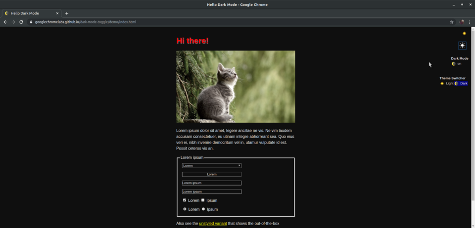

# Polymer

Este es un repositorio dedicado a una simple introducción a los Web Components con Polymer. En él expondremos una serie de ejemplos con la finalidad de mostrar el potencial de esta herramienta y enseñar un poco cómo funciona.
Este proyecto ha sido realizado por José Manuel Alcalde Llergo ([JoseManuelAlcaldeLlergo]) y Tomás Fernández Urbano ([TomasFdez5]), estudiantes del Grado en Ingeniería Informática de la Universidad de Córdoba.

# Instalar tutorial

Para desarrollar nuestro tutorial, ¿qué mejor que hacerlo en el propio Polymer?. En primer lugar veamos como podemos instalar Polymer en nuestro equipo, para después poder desplegar nuestro tutorial personalizado de Polymer.

## 1 ¿Cómo instalar Polymer?

Existen una serie de prerrequisitos para instalar la versión 3.0 de Polymer:

* Instalar Git.

* Instalar npm

* Instalar Node.js

### 1.1 Instalar Git

Para instalar Git en nuestra máquina tendremos que utilizar los siguientes comandos:

Actualizamos la lista de paquetes disponibles, así como sus versiones, e instalamos Git propiamente dicho.
```
$ sudo apt update
$ sudo apt install git
```

### 1.2 Instalar npm

Node Package Manager ([npm]) es el sistema de gestión de paquetes por defecto para Node.js, un entorno de ejecución para JavaScript. 
Para instalarlo debemos utilizar el siguiente comando: 
```
sudo apt install npm
```
Pudiendo verificar que la instalación ha sido correcta con el comando:
```
npm -v
```

### 1.3 Instalar Node.js

[Node.js] es un entorno de ejecución de JavaScript pensado para construir aplicaciones en red escalables. 
Para instalarlo emplearemos el comando:
```
sudo apt install nodejs
```

### 1.4 Instalar Polymer-CLI

Como último paso vamos a instalar la interfaz por línea de comandos de Polymer (Polymer-CLI). Para ello lo haremos con el gestor de paquetes instalado previamente npm y realizaremos la instalación de manera global mediante la opción -g:
```sh
sudo npm install -g polymer-cli
```
## 2 Desplegar el tutorial

Ahora que ya tenemos instalado Polymer en nuestro equipo vamos a ver cómo desplegar el tutorial que hemos desarrolado a partir del starter-kit de Polymer en el cual explicamos qué es Polymer, cómo comenzar a desarrollar componentes del mismo, cómo utilizar diferentes componentes para nuestros propios proyectos, así como qué ventajas e inconvenientes tiene frente a otras librerías.

### 2.1 Clonar nuestro repositorio

Lo primero que debemos hacer es dirgirnos a nuestro [repositorio]. A continuación, debemos clonar su contenido, lo cual podemos hacerlo de dos maneras:

- Descargar el comprimido con su contenido dandole a la opción *Clone or download* y seleccionar *DOWNLOAD ZIP*.


- Clonarlo en tu propio repositorio local de Git. Para ello en la carpeta donde quieras inicializar el repositorio:

* Abrir un terminal y ejecutar el comando ```git init```.
* Ejecutar el comando ```git clone https://github.com/JoseManuelAlcaldeLlergo/Polymer.git```


Una vez aquí, nos encontramos que en nuestra carpeta tenemos todos los archivos necesarios para realizar el tutorial y sus respectivos ejemplos.

### 2.2 Desplegar el tutorial

Para desplegar el tutorial, en el directorio *tutorial* debemos hacer:

1. Abrir un terminal, y ejecutar el comando ```npm install``` para instalar las dependencias de Polymer necesarias. Esto puede tardar unos minutos.
2. Ejecutar el comando ```polymer serve -o``` para abrir directamente nuestro tutorial en vuestro navegador predeterminado.

Una vez hecho esto, tendrás acceso a nuestro tutorial, en el que podrás ver cómo hemos realizado cada uno de los distintos ejemplos que vas a encontrar en el repositorio que has clonado anteriormente.

# Motivaciones

¿Y por qué usar Polymer? Con él podemos hacer multitud de cosas, desde componentes sencillos como los que expondremos en el tutorial hasta montar una tienda y modelar figuras en 3D. Veamos aquí algunos ejemplos del potencial que tiene:

* [dark-mode-toogle] creado por [GoogleChromeLabs], un componente que permite añadir un selector de modo diurno a modo nocturno con un simle click. Trabajaremos con ella en nuestro tutorial.


 




* [model-viewer] creado por [GoogleWebComponets], permite renderizar modelos 3D de manera interactiva. 


* [the shop app] permite crear una tienda online completa mediante el uso de varios componentes creados en polymer.


Como podemos observar, con Polymer se pueden hacer todo tipo de aplicaciones y reutilizarlas en distintos proyectos. Para poder tener acceso a todos ellos, ¡no dudes en descargarte nuestro tutorial y comenzar a explorar su amplía variedad de elementos paa usarlos en tus futuros proyectos!


[dark-mode-toogle]: https://www.webcomponents.org/element/dark-mode-toggle

[GoogleChromeLabs]: https://www.webcomponents.org/author/GoogleChromeLabs

[model-viewer]: https://www.webcomponents.org/element/@google/model-viewer

[GoogleWebComponets]: https://www.webcomponents.org/element/@google/model-viewer

[the shop app]: https://polymer-library.polymer-project.org/1.0/docs/apps/case-study 

[repositorio]: https://github.com/JoseManuelAlcaldeLlergo/Polymer

[W3C]: https://www.w3c.es 

[desarrollo declarativo]: https://prezi.com/7vcuauwjiqzf/programacion-declarativa-vs-programacion-imperativa/

[npm]: https://devcode.la/blog/que-es-npm/

[Node.js]: https://nodejs.org/es/about/

[JoseManuelAlcaldeLlergo]: https://github.com/JoseManuelAlcaldeLlergo?tab=repositories 

[TomasFdez5]: https://github.com/TomasFdez5?tab=repositories
