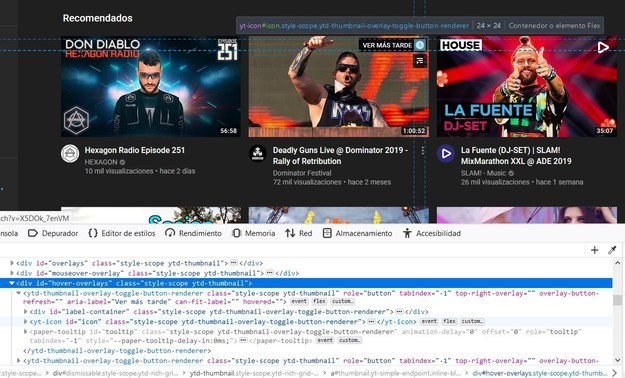

## Caso de éxito

### Youtube

Volviendo al año 2018, Google decidió presentar su nuevo diseño para mejorar la experiencia del usuario en su plataforma haciendo que resalte sus videos y creadores favoritos de una manera más fácil. Explicaron que aplicaron un *diseño de materiales* buscando unos principios clave para ellos:

* Simplicidad 
* Consistencia 
* Belleza  

Fue en este momento donde Polymer entró en escena. Google decidió utilizar Polymer ya que les permitía tener un desarrollo más rápido, nuevo e intuitivo, presentando alguna de sus características innovadoras desarrolladas en Polymer como fue **Dark Theme**. A continuación podemos ver algunos de los componentes personalizados que Youtube utiliza en su nuevo diseño.

Pero... no todo fue bonito para Google ya que desde esta gran actualización de la plataforma fueron numerables las denuncias que tuvo el desarrollo seguido para actualizar Youtube ya que esto provocaba que funcionase de manera mucho más lenta cuando se usa desde los navegadores de la competencia. Pero Google a pesar de ello ganó clientes ya que necesitaban su navegador para ver Youtube, esta plataforma de video tan famosa y que todos conocemos. 

Según Chris Peterson, Gerente de Programas Técnicos de Mozilla, todo esto fue una estrategia de Google para perjudicar a sus rivales. Él mismo propuso una solución a este problema y fue utilizar una extesión de Firefox o Edge que permite ejecutar la versión anterior de Yotube.

Referencias:
* [Youtube's official Blog].

[Youtube's official Blog]: https://youtube.googleblog.com/2017/05/a-sneak-peek-at-youtubes-new-look-and.html 

* [Artículo en un portal de noticias].

[Artículo en un portal de noticias]: https://hub.packtpub.com/youtubes-polymer-redesign-doesnt-like-firefox-and-edge-browsers/

## Caso de estudio

### Polymer sustituirá a PHP

El proyecto Polymer de Google creó la biblioteca de plantillas *lit-html* basada en JavaScript y lanzó más recientemente LitElement, una solución para crear componentes web rápidos y livianos. La solución de Google para plantillas es lit-html. La biblioteca de plantillas se introdujo por primera vez en 2017 en Polymer Summit. En febrero de 2019, Google anunció el lanzamiento de la versión de producción de LitElement.

[LitElement] está diseñado para construir componentes independientes que se pueden usar en una multitud de entornos. A medida que la tendencia hacia la utilización de marcos, plantillas y componentes de JS continúa creciendo, lit-html y LitElement están bien posicionados para su adopción. Esto se debe a que Google los ha hecho compatibles con prácticamente cualquier entorno.

[LitElement]: https://lit-element.polymer-project.org/

Pero ¿será capaz de sustituir a PHP?. Recordemos que PHP es un lenguaje de script de código abierto que se mantiene activamente y es adecuado para el desarrollo web. Además las soluciones PHP existentes funcionan bien y son familiares para sus usuarios, por ejemplo *WordPress*. El **inconveniente** que presenta PHP es que solo puede ejecutarse en el servidor, lo que requiere que el navegador espere las respuestas del servidor antes de que pueda alterar el DOM (cambiar objetos en la página).

Aún no se tiene claro si las ventajas que proporciona Polymer serán capaces de situarlo por delante de PHP pero lo que sí está claro es que a Polymer le queda futuro por adaptarse, evolucionar y asombrarnos con sus avances.

Puedes ver el [artículo publicado] en el que Gray Norton, líder de ingeniería de software para Polymer en Google, comentó algunas opiniones.

[Polymer Summit]: https://www.youtube.com/watch?v=ruql541T7gc

[artículo publicado]: https://www.coywolf.news/webmaster/google-lit-templates-web-components/
