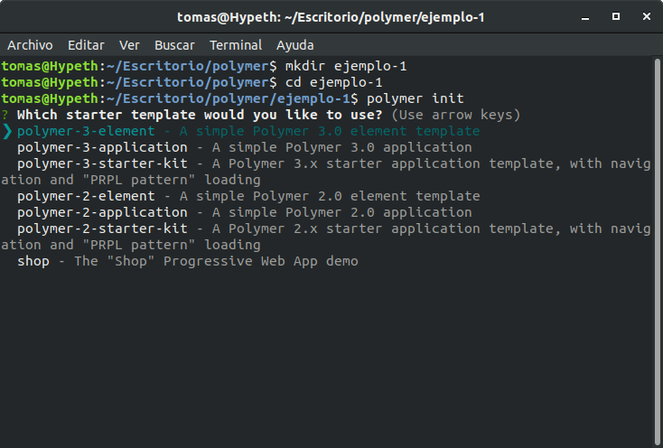
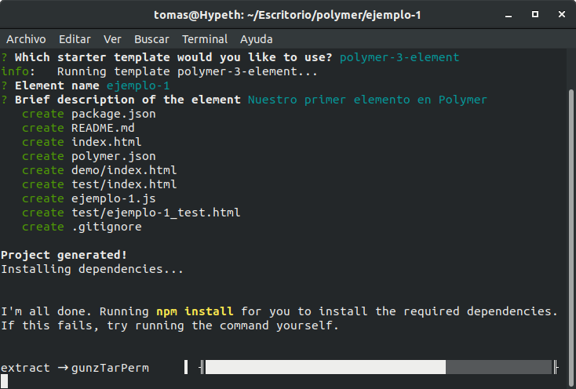
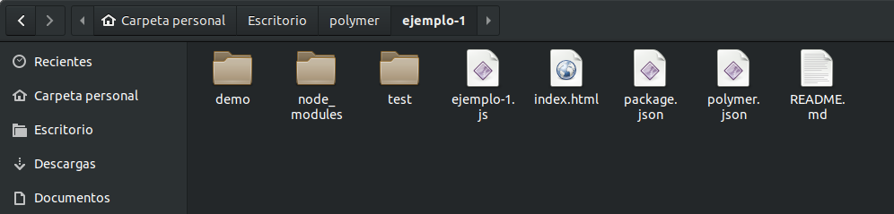
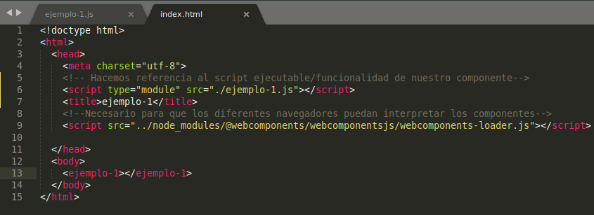
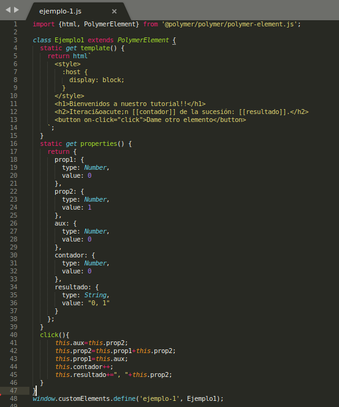

## Primeros pasos

### Instalación de Polymer

Existen una serie de prerrequisitos para instalar la versión 3.0 de Polymer:

* Instalar Git.

* Instalar npm y Node.js

### 1.1 Instalar Git

Para instalar Git en nuestra máquina tendremos que utilizar los siguientes comandos:

Actualizamos la lista de paquetes disponibles, así como sus versiones, e instalamos Git propiamente dicho.
```
sudo apt update
sudo apt install git
```

### 1.2 Instalar npm

Node Package Manager ([npm]) es el sistema de gestión de paquetes por defecto para Node.js, un entorno de ejecución para JavaScript. 
Para instalarlo debemos utilizar el siguiente comando: 
```
sudo apt install npm
```
Pudiendo verificar que la instalación ha sido correcta con el comando:
```
npm -v
```

### 1.3 Instalar Node.js

[Node.js] es un entorno de ejecución de JavaScript pensado para construir aplicaciones en red escalables. 
Para instalarlo emplearemos el comando:
```
sudo apt install nodejs
```

### 1.4 Instalar Polymer-CLI

Como último paso vamos a instalar la interfaz por línea de comandos de Polymer (Polymer-CLI). Para ello lo haremos con el gestor de paquetes instalado previamente npm y realizaremos la instalación de manera global mediante la opción -g:
```
sudo npm install -g polymer-cli
```
## Cómo iniciar mi proyecto

Una vez instalado Polymer, creamos un directorio en el cual se almacenarán los ficheros que nos proporcionará Polymer, en nuestro caso “ejemplo-1”. Una vez en él, realizamos el comando ```polymer init```, en el directorio en el que deseemos trabajar, para iniciar nuestro proyecto. Tras esto:



Cabe diferenciar, de la salida de este comando, las diferentes opciones que polymer nos proporciona:
* **polymer-3-element**: crea un fichero javascript (ejemplo-1.js) que conforma una plantilla básica para nuestro elemento. Además, proporciona un fichero html para la demostración  de su uso.

* **polymer-3-application**: crea un fichero html que conforma una plantilla básica de utilización de un elemento. Al igual que polymer-3-element, crea un fichero javascript que es la plantilla del elemento utilizada pero, en este caso, está situado en directorio src al cual se hace referencia desde el html. 

* **polymer-3-starter-kit**: nos crea un ejemplo más complejo de la utilización de varios elementos implementados sobre un mismo fichero html. La temática de este apartado es ver cómo se pueden implementar distintas vistas en un sitio web.


## ¡Hola Fibonacci!

A continuación vamos a crear nuestro propio elemento, ejemplo-1, cuya finalidad será darnos la bienvenida a este tutorial y, además, podremos solicitarle que nos muestre el siguiente elemento de la sucesión de Fibonacci. Para ello, como primer paso escogeremos la opción **polymer-3-element**, la cual nos pedirá información sobre nuestro elemento (nombre, descripción).



Como se puede apreciar, se está utilizando el sistema de gestión de paquetes npm que hemos instalado previamente, para instalar las dependencias que se requieren. Una vez terminada la instalación se nos generan varios ficheros en nuestro directorio:

* **package.json**: contiene la información acerca de las dependencias (ficheros y librerías de terceros) que estamos utilizando en el proyecto. Este fichero es el que indicará a npm las dependencias que debe instalar para poder lanzar correctamente la aplicación de Polymer.

* **polymer.json**: información para que la interfaz de polymer sepa cómo es nuestro proyecto.

* **README.md**: contiene un pequeño tutorial de cómo utilizar lo generado por polymer y enlaces a información adicional.

* **ejemplo-1.js**: es el javascript de nuestro componente. Es importante que en el nombre de todos nuestros componentes pongamos un guión para diferenciar que son personalizados y no confundirlos con etiquetas de html.

* **index.html**: será el fichero desde el cual utilizaremos la funcionalidad de nuestro componente.



¡Ya tenemos listos nuestros ficheros para trabajar!. Pero... ¿cómo utilizo mi componente desde mi fichero html?. Es muy sencillo e intuitivo, simplemente tendremos que añadir un script en nuestro fichero html haciendo referencia a nuestro fichero Javacript que contiene la funcionalidad de nuestro componente, de la forma:
```
<script type="module" src="./ejemplo-1.js"></script>
```
A continuación ya podremos incluir una instancia de nuestro componente dentro del cuerpo del html de manera muy similar a una etiqueta, en nuestro caso este se llamará de la forma:
```
<ejemplo-1></ejemplo-1>
```
Cabe destacar que en este ejemplo el componente no requiere de parámetros, por tanto, al usuario le basta con declarar esta simple línea. En definitiva, utilizar este sencillo componente se realizaría de la forma:



Por último, analicemos el archivo JavaSript *ejemplo-1.js* que contiene el comportamiento de nuestro componente.
Lo primero que debe contener es un *import* al archivo JavaScript que contiene la definición de la clase *PolymerElement*, de la cuál heredará todo componente de Polymer:
```
import {html, PolymerElement} from '@polymer/polymer/polymer-element.js';
```
A continuación se declara la herencia mencionada anteriormente y en ella definiremos mediante métodos la plantilla (template) y las propiedades (properties) de nuestro componente:
* Plantilla: es lo que va a mostrar nuestro componente al navegador. Para ello utilizaremos lenguaje de marcado html y todo estará contenido dentro de: 
```
return html ` [contenido] `
```
* Propiedades: son las propiedades o variables que empleará nuestro componente en sus métodos para su funcionamiento. Para mostrarlas en el html, en la plantilla se invocarán de la siguiente manera: *[[propiedad]]*
En este fichero también se encuentran los métodos que emplea nuestro componente como por ejemplo la función *click* en nuestro caso.
Por último, para definir nuestro elemento como una nueva etiqueta de html debemos emplear: 
```
window.customElements.define('ejemplo-1', Ejemplo1);
```
A continuación podemos ver el contenido del fichero completo:



De esta manera, en una simple línea como mostramos ya en el html podremos recurrir a la funcionalidad de nuestro componente.

[npm]: https://devcode.la/blog/que-es-npm/
[Node.js]: https://nodejs.org/es/about/
