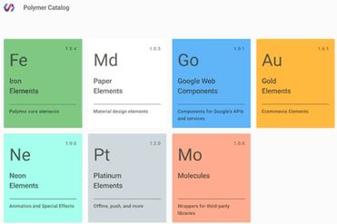

## 1. ¿Qué es Polymer?

Polymer es una librería basada en los estándares de Web Components que nos permite desarrollar entornos web de una manera rápida y sencilla. Esta librería ha sido creada por Google, que la define como “a new type of library”. Además Polymer permite funcionar con JavaScript estándar, basado en las especificaciones de World Wide Web Consortium ([W3C]). 

Uno de los aspectos más destacables de Polymer es que permite el [desarrollo declarativo]. Así podemos empezar nuestro proyecto en base a la declaración de elementos con etiquetas HTML que realizarán las acciones que tu desees de manera más sencilla y fiable que si usaramos un desarrollo imperativo.

### 1.1 ¿Qué lo diferencia de otras librerías?

En su competencia con otras librerías y frameworks tenemos que saber que podemos usar Polymer de manera conjunta con ellos pero, también, es totalmente viable realizar una aplicación web basada en Polymer sin ninguno de estos recursos del lado cliente  adicionales. Esto es debido a que Polymer tiene implementadas ya muchas de las funcionalidades que ofrecen algunas de las librerías o frameworks de JavaScript. 

La principal diferencia con otras librerías, como AngularJS o ReactJS, es que está construido basándose en las especificaciones de los Web Components ([W3C]). Por ello se podría suponer que esta librería tendrá una vida más larga respecto a otras alternativas en el desarrollo de interfaces de usuario y aplicaciones web.

### 1.2 ¿Qué son los Web Components?

Los Web Components son una revolución en el mundo del desarrollo web y cada vez están consiguiendo más soporte por parte de los navegadores. Su objetivo es ofrecer un estándar enfocado a la construcción de todo tipo de componentes utilizables en una página web, para realizar interfaces y otras tecnologías del lado del cliente. Estos elementos podrán ser creados por los desarrolladores y  compartidos para que los puedan usar otras personas, siendo esta una manera de enriquecer la web reutilizando componentes de una forma sencilla, pudiendo crear nuevos componentes en base a otros.

Un ejemplo que muestra la utilidad de los Web Components es por ejemplo en un mapa de Google. Sin usar Web Components tendríamos que crear un HTML para renderizar el mapa, un CSS para definir el estilo y un Javascript para poder desarrollar el mapa; mientras que con Web Components podemos agrupar estos tres bloques en un código único y así expresar el mapa con una única etiqueta propietaria (que no pertenece al estándar de HTML).

### 1.3 ¿Qué contiene Polymer?

Polymer tiene tres elementos principales enfocados en la creación de Web Components:

* Un sistema de Polyfills, que permiten dar soporte al estándar de Web Components a navegadores que no lo han implementado todavía de manera nativa.

* Un kit de herramientas destinadas a que cualquier desarrollador pueda crear sus propios componentes.

* Una librería de elementos clasificados en varias áreas, en los cuales podremos basarnos para hacer nuestros componentes y hacer que nuestra página web tenga un comportamiento personalizado.

### 1.4 Catálogo de elementos

Polymer nos proporciona un amplio catálogo de elementos divididos en secciones para que podamos empezar explorándolos y probándolos para ver qué se puede hacer y cuá es su potencial. Estas secciones son:

* **Fe: Iron Elements**: estos elementos forman parte del "core" de Polymer y generalmente están pensados para no usarlos de manera única, sino para usarlos en conjunto con otros. Por ejemplo encontraremos iconos, que podrías utilizar de manera independiente en una página, pero generalmente se combinan con otros elementos para hacer barras de navegación, listas decoradas, etc.

* **Md: Paper Elements**: es una lista de interfaces de usuario útiles para muchos tipos de proyectos. Están basados en la línea estética y funcional del "material design" de Google, por lo que ya nos ofrecen una buena base para poder hacer aplicaciones bastante atractivas visualmente. 

* **GO: Google Web Components**: es un catálogo de componentes que forman un wrapper a diversas API de Google. Por ejemplo podemos usar estos "envoltorios" para crear mapas de Google, acceder a documentos de Drive, trabajar con calendarios, etc.

* **Au: Gold Elements**: estos sirven específicamente para el comercio electrónico, formularios, sistemas de validación de tarjetas de crédito, etc. 

* **Pt: Platinum Elements**: son elementos que sirven para asuntos relacionados con la operativa de aplicaciones para móviles, como por ejemplo, poder trabajar offline y poder operar con la página aunque no se tenga conexión, trabajar con notificaciones, etc. 

* **Mo: Molecules**: son envoltorios de librerías de terceros, para usar mediante la arquitectura de los web components.

* **Ne: Neon Elements**: sirven para crear animaciones y efectos especiales en los componentes. 

	

## 2.Ventajas e inconvenientes

### 2.1 Ventajas de usar Polymer 

* Puedes crear tus propios Custom Elements: permite implementar la funcionalidad que se desee y bajo nuestro criterio a un componente, el cual se puede reutilizar en otros proyectos ya que es independiente del resto de aplicación. 

* Utiliza el Shadow DOM, que permite encapsular  el  contenido de un Custom Element del resto y así evitar que sus estilos y código interactúen de forma no deseada con el resto de la aplicación.

>  **¿Qué es el Shadow DOM?**

 > **Shadow DOM** viene a ser el DOM “oculto", una capa que se introduce dentro del DOM del navegador y que “esconde" nuestros componentes de tal manera que todo elemento o script exterior a esta capa no podrá acceder a sus elementos interiores. Esto quiere decir que tendremos componentes encapsulados cuyas funciones y estilos no van a interferir en el resto de la aplicación.

* **Más mantenible** ya que si se decidiera cambiar la funcionalidad de un componente no hay que modificarlos en todos los lugares donde se utilice, sino sólo en el propio componente.

* Nos permite compartir nuestros componentes fácilmente a la comunidad para utilizarlos en otros proyectos así como utilizar otros ya creados por la comunidad que tengan una funcionalidad que nos interese.
 
* El hecho de que Polymer esté apoyada por Google y que esté basado en los estándares de la W3C, nos indica que tendrá mucho margen para crecer, así como una larga vida.

### 2.2 Algunas desventajas

* Necesita de un Polyfill para ser compatible con todos los navegadores. 

>  **¿Qué es un Polyfill?**

 > Un **polyfill** es un fragmento de código utilizado para proporcionar una funcionalidad moderna en navegadores antiguos que no la admitían de forma nativa. En nuestro caso añadimos el componente que nos proporciona Polymer para ello:

			

* Cuando se trata de desarrollar web complejas, Polymer necesita complementarse con otras herramientas para llegar a ser un entorno de trabajo íntegro.

* El soporte de Web Components todavía es muy bajo. Sólo Google Chrome los implementa totalmente.

* Como Web Components es un estandar que esta aún en desarrollo, por lo que es muy probable que las aplicaciones que se realicen ahora mismo con Polymer se tengan que estar actualizando y modificando a menudo.

[W3C]: https://www.w3c.es 

[desarrollo declarativo]: https://prezi.com/7vcuauwjiqzf/programacion-declarativa-vs-programacion-imperativa/
