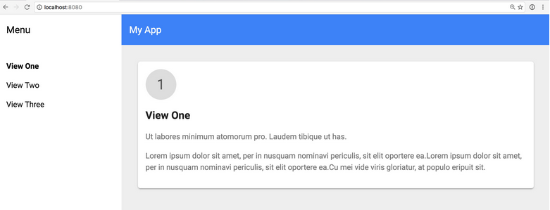
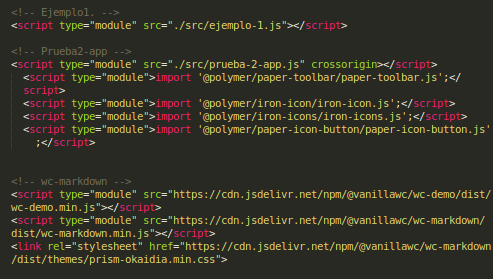
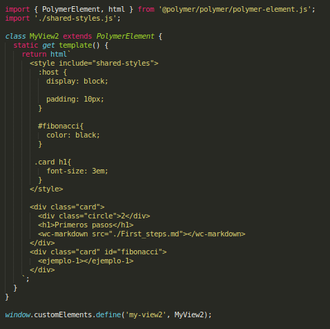

## Tutorial

Como último ejemplo del uso de Polymer, hemos creado un tutorial a partir del starter-kit que nos proporciona Polymer (se puede instalar fácilmente con ```polymer init```). Con este starter-kit lo que se pretende es darnos una base para a partir de ella poder configurar nuestra aplicación. Al iniciarlo de primeras, podemos ver que se despliega una página con distintas vistas, siendo cada una un componente de Polymer que podemos modificar a nuestro gusto para nuestra aplicación.



En definitiva, para crear este tutorial nos hemos ayudado principalmente de este starter kit y de [wc-markdown], un componente de Polymer desarrollado por [vanillawc] que nos permite leer y mostrar archivos md con el formato de markdown en nuestra página web. De esta manera, solamente nos ha sido necesario crear los archivos markdown y añadirlos en las diferentes vistas para mostrar las distintas partes de nuestro trabajo.

A continuación, veremos brevemente cómo lo hemos hecho:

En primer lugar, agregamos todos los componentes que vamos a utilizar en index.html para poder usarlos y mostrarlos en la página. Para ello añadimos en el fichero:



Luego, nos dirigimos al directorio src, en el que se encontrarán todos los archivos JavaScript tanto de la aplicación como de las vistas y los componentes. En él, el componente principal que tenemos que modificar es my-app.js, el cual será lo único que se llame en el index.html para desplegar la aplicación. Nosotros en este fichero lo único que hemos tenido que añadir han sido los nombres de las nuevas vistas que hemos incorporado y prepararlas para que sean mostradas cuando se seleccionen. En este fichero también es en el que podemos cambiar el estilo de la página (por ejemplo el color y el contenido de la cabecera) modificando los estilos de los componentes que se emplean en ella.

Por último, solo nos falta crear nuestras propias vistas. Para ello, aprovechamos la clase *card* del starter kit (contenida en shared-styles.js) para dividir el contenido dentro de las mismas, y en ellas simplemente cargamos el markdown correspondiente a su explicación del tutorial y el componente del que estemos hablando como ejemplo. Podemos ver que cargar el markdown con este componente es muy sencillo, simplemente es necesario pasarle la ruta del fichero y lo cargará en nuestra aplicación.



De esta manera, podemos ver que a partir del starter kit que nos aporta Polymer, es relativamente sencillo crear una aplicación funcional, que en nuestro caso nos ha permitido documentar y mostrar un poco el potencial de esta herramienta.

[wc-markdown]: https://www.webcomponents.org/element/@vanillawc/wc-markdown
[vanillawc]: https://www.webcomponents.org/author/vanillawc
